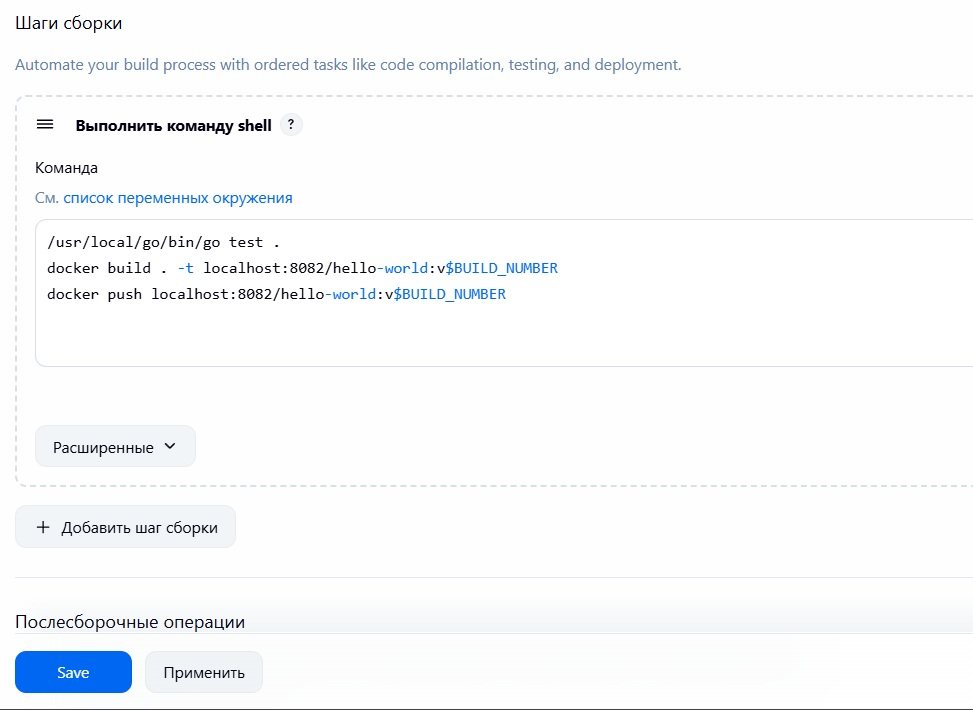
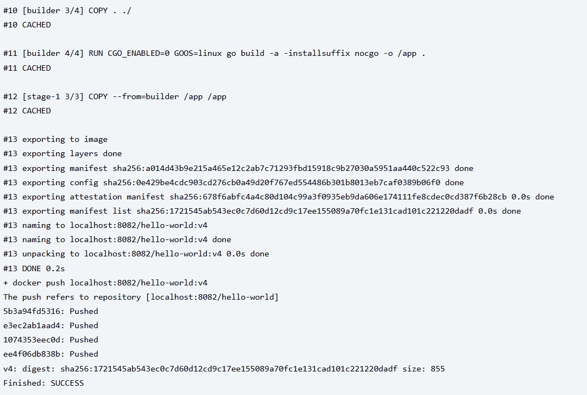
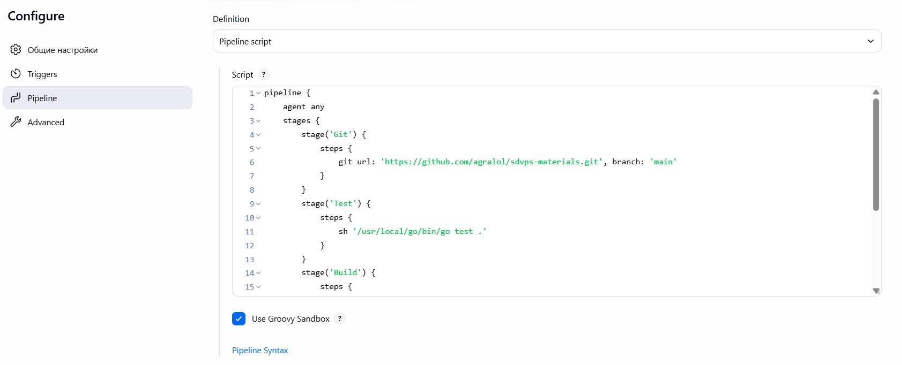
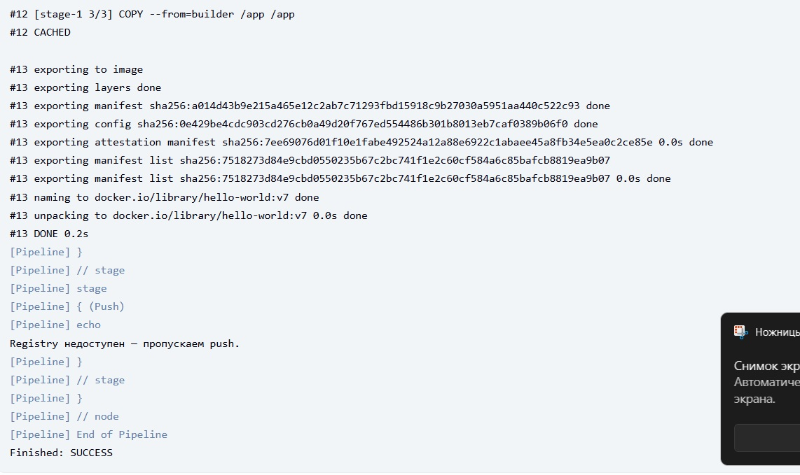

# Домашнее задание к занятию "GIT" - "`Chernov Vyacheslav`"

### Задание 1

[Commit](https://github.com/agralol/git-hw/commit/16c28b6012a6ecd629133cc471948d9c27031a93)

---

### Задание 2

[Commit 2](https://github.com/agralol/git-hw/commit/6ab3a8e5780a99d51b8bacb3d495e4da923c7976)

---

### Задание 3

[Commit 3](https://github.com/agralol/git-hw/network)

# Домашнее задание к занятию "Что такое DevOps. CI/CD" - "`Chernov Vyacheslav`"

### Задание 1

### Задание 2

